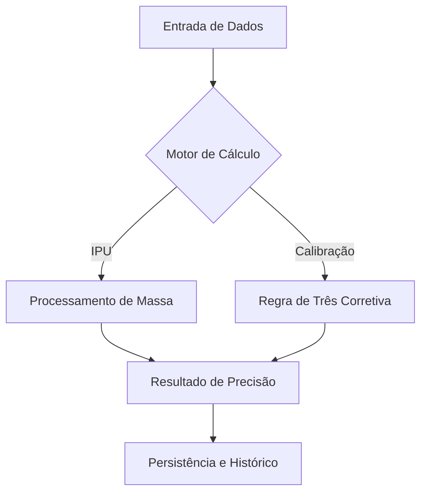

# 💎 Calculadora IPU
> Precisão Industrial em Alta Performance, Online ou Offline.

[](https://github.com/ednosmab/ipu-calculator/actions/workflows/ci.yml)
**Version:** 1.2.17 | **License:** Proprietary | **Platform:** PWA / Mobile (Expo)

---

## 🎯 Proposta de Valor
A **Calculadora IPU** é uma ferramenta de alta precisão projetada para o ambiente industrial, focada em eliminar erros de cálculo manual e garantir a consistência técnica no processamento de poliuretano. 

A aplicação prioriza a **confiabilidade matemática** acima de tudo, suportada por uma infraestrutura resiliente que garante disponibilidade total em ambientes com conectividade instável.

---

## 🧠 O Coração da Aplicação (Core Engines)

A inteligência do projeto reside em dois motores de cálculo fundamentais, isolados em camadas de domínio puro para garantir precisão absoluta:

### 1. Motor de Cálculo de Injeção de IPU
Calcula o índice de injeção necessário com base na massa combinada de Isocianato e Poliol.

### 2. Motor de Calibração de Vazão de IPU
Utiliza a **Regra de Três Industrial** para corrigir os valores de máquina com base no peso real extraído vs. o peso desejado em processos de IPU.



---

## 🏗️ Pilares Arquiteturais (A "Armadura")

Embora os cálculos sejam o coração, a robustez da Calculadora IPU é garantida por quatro pilares técnicos:

### 📱 PWA Industrial (Offline-First)
- **Disponibilidade Total:** Funciona 100% sem internet através de Service Workers altamente otimizados.
- **Sincronização Desacoplada:** Persistência local imediata (Optimistic UI) com sincronização em background para o Supabase.

### 🏛️ Clean Architecture
- **Domínio Isolado:** Regras de negócio protegidas de dependências externas.
- **Camada de Infraestrutura:** Repositórios com travas atômicas (Mutex) para evitar corrupção de dados durante acessos simultâneos.

### 🎨 Design System Industrial
- **UI de Alta Performance:** Interface escura (OLED optimized), com tipografia de alta legibilidade e elementos táteis otimizados para uso com luvas ou em ambientes de fábrica.
- **Tokens Semânticos:** Consistência visual absoluta via Design System próprio.

### 🌍 i18n Nativo
- Suporte nativo a Português e Inglês, com detecção automática e troca dinâmica sem recarregar o app.

---

## 🛠️ Stack Tecnológica

- **Core:** React Native (Expo) + TypeScript
- **Web:** Expo Router + Next.js (Optimized PWA)
- **Persistência:** AsyncStorage (Local) + Supabase (Remote)
- **Testes:** Jest + React Native Testing Library (88 testes integrados)
- **Estilos:** Vanilla CSS (Web) / StyleSheet (Native) com Design System Atômico.

---

## 📖 Guia Técnico Completo
A documentação completa da arquitetura, decisões técnicas e fluxos do projeto está disponível como um web viewer interativo via GitHub Pages:

- **GitHub Pages:** [ednosmab.github.io/ipu-calculator](https://ednosmab.github.io/ipu-calculator/)

> **Nota:** O Guia Técnico é servido a partir da branch `refactor`, pasta `/docs`. Para que o link funcione, o GitHub Pages deve estar ativo em **Settings > Pages > Source: Deploy from a branch > branch `refactor`, folder `/docs`**.

---

## 🚀 Como Executar

### Pré-requisitos
- Node.js 20+
- NPM ou Yarn

### Instalação
```bash
git clone https://github.com/ednosmab/ipu-calculator.git
cd ipu-calculator
npm install
```

### Desenvolvimento
```bash
npx expo start
```

### Testes
```bash
npm test
```

---

## 📜 Protocolos de Skill (Documentation as Code)
O projeto é guiado por protocolos rigorosos localizados em `./docs/skill/`:
- [🎬 Protocolo de Animação e Transição](docs/skill/animation_protocol.md)
- [SKILL: Architectural Integrity & Dependency Guard](docs/skill/architectural_integrity_protocol.md)
- [Background Sync Orchestration Protocol](docs/skill/background_sync_orchestration.md)
- [SKILL: Cache Versioning Protocol](docs/skill/cache_versioning_protocol.md)
- [🛠️ Skill: Arquiteto Clean Code & International Standard](docs/skill/clean_code_architect.md)
- [Codebase Hygiene Protocol](docs/skill/codebase_hygiene_protocol.md)
- [🧠 Skill: Design System & Product Refinement](docs/skill/design-system-master.md)
- [Design System Tokenization Protocol](docs/skill/design_system_tokenization_protocol.md)
- [Documentation as Code Protocol](docs/skill/documentation_as_code_protocol.md)
- [SKILL: Error Handling & Observability](docs/skill/error_handling_observability.md)
- [SKILL: Git Workflow & Commit Standard](docs/skill/git_workflow.md)
- [i18n Integration Protocol](docs/skill/i18n_integration_protocol.md)
- [SKILL: i18n Protocol (Internacionalização)](docs/skill/i18n_protocol.md)
- [SKILL: Model Persistence & Atomic Write Protocol](docs/skill/model_persistence_protocol.md)
- [SKILL: Network Connectivity Protocol (Web & Mobile)](docs/skill/network_connectivity_protocol.md)
- [Protocolo: Resolução de Erros de Rede e CORS (Vercel + Supabase)](docs/skill/network_cors_protocol.md)
- [SKILL: Optimistic UI & Sync Indicators](docs/skill/optimistic_ui_sync_indicators.md)
- [SKILL: Page Title Standardization](docs/skill/page-title-standard.md)
- [SKILL: Desenvolvimento de Feature com Arquitetura e Testes](docs/skill/principal_skill.md)
- [SKILL: PWA Lifecycle & Update Protocol](docs/skill/pwa_lifecycle_protocol.md)
- [SKILL: Resilient Error Handling & UI Recovery](docs/skill/resilient_error_handling.md)
- [SKILL: Schema Migration & Data Evolution Protocol](docs/skill/schema_migration_protocol.md)
- [🛠️ Especificações Técnicas1. Posicionamento e AnatomiaLocalização Principal: Canto Superior Esquerdo (Top-Left).Zona de Toque (Touch Target): Mínimo de 44x44px ou 48x48dp para evitar erros de clique.Ícone: ☰ (três linhas horizontais de mesma espessura).Label (Opcional): Em apps voltados para público leigo ou idoso, incluir o texto "Menu" abaixo ou ao lado do ícone.2. Comportamento (Interaction Design)Tipo de Painel: Overlay Drawer (o menu desliza sobre o conteúdo).Scrim (Fundo): Escurecimento do conteúdo principal (opacidade entre 40% e 60%) para focar a atenção no menu.Gesto de Saída: O usuário deve conseguir fechar o menu clicando fora dele (na área do Scrim) ou deslizando para a esquerda (Swipe back).📐 Regras de Hierarquia de ConteúdoAo organizar os itens dentro do menu, utilize a seguinte ordem:Header: Identificação do usuário (Foto, Nome, Email).Navegação Secundária: Itens que não cabem na barra inferior (Configurações, Histórico, Favoritos).Suporte: Ajuda, FAQ, Termos de Uso.Footer: Botão de "Sair" (Logout) e versão do aplicativo.⚖️ Critérios de Decisão (Checklist de UX)CritérioUse Menu Hambúrguer se...Use Barra Inferior se...ImportânciaAs funções são de suporte/ajuste.As funções são o coração do app.QuantidadeVocê tem mais de 5 destinos principais.Você tem entre 3 e 5 destinos.FrequênciaO usuário acessa raramente (ex: Configurações).O usuário alterna o tempo todo (ex: Home/Busca).♿ Acessibilidade e Boas PráticasFoco de Teclado: Se o app for usado com leitores de tela, o foco deve "saltar" para dentro do menu assim que aberto.Contraste: Garantir contraste mínimo de 4.5:1 entre o ícone e a cor da barra superior.Reachability: Lembre-se que o canto superior esquerdo é a "Zona Vermelha" (difícil alcance). Não coloque ações críticas de conversão (como "Comprar Agora") apenas dentro do hambúrguer.🚀 Como Implementar (Dev Handoff)Animação: Duration: 300ms | Easing: Decelerate or Ease-out.Z-Index: Deve ser superior a qualquer outro elemento da página (ex: z-index: 1000).Estado: Manter o estado do scroll do menu independente do scroll da página principal.](docs/skill/side_navigation_design.md)
- [SKILL: Sync Engine & Offline-First Architecture](docs/skill/sync_offline_architecture.md)
- [SKILL: Testing Protocol](docs/skill/testing_protocol.md)
---

## 🔒 Propriedade Intelectual
Este software é **Proprietário**. Todos os direitos são reservados ao autor do projeto. O acesso, uso, cópia ou distribuição de qualquer parte desta aplicação é estritamente proibido sem autorização prévia por escrito.
---

> **Orquestração e Visão Técnica:** [Edson]
> **Desenvolvimento Assistido:** Antigravity Architect AI & OpenCode Team