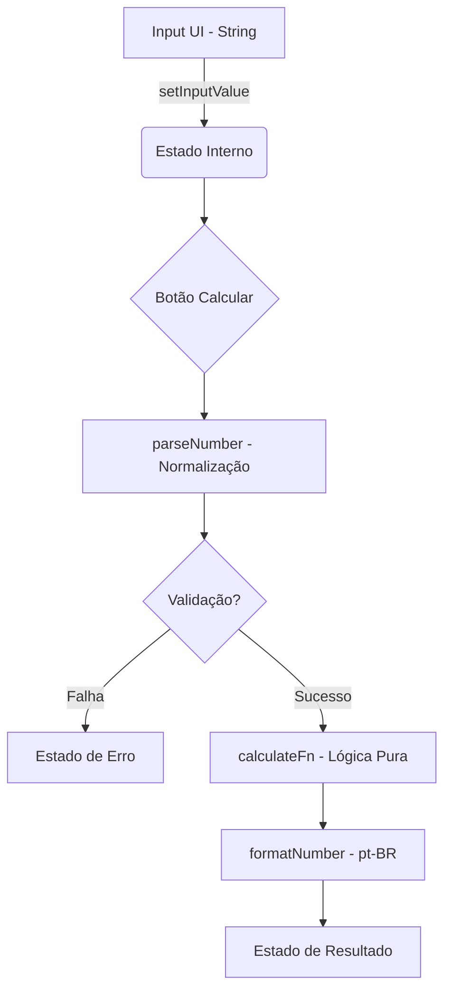

# Guia Técnico: useCalculatorLogic

Este documento descreve o funcionamento e as diretrizes do hook genérico `useCalculatorLogic`, o motor central de cálculos deste projeto.

## 🎯 Objetivo
Prover uma abstração reutilizável e tipada que separa a orquestração de cálculos (estado, parse, validação e formatação) da interface do usuário (UI), garantindo consistência e aderência aos princípios **SRP** (Single Responsibility Principle) e **DRY** (Don't Repeat Yourself).

## 🏗️ Estrutura da Configuração
O hook recebe um objeto `CalculatorConfig<T>` com os seguintes campos:

- **`inputs`**: Array de chaves (strings) que definem os campos de entrada.
- **`calculateFn`**: Função pura que recebe os números parseados e retorna o resultado numérico.
- **`validate`** (Opcional): Função que recebe os números e retorna um booleano para autorizar o cálculo.

## 🔄 Fluxo de Dados


## 📝 Exemplos de Implementação

### 1. Calculadora de IPU
```typescript
const config = {
  inputs: ['iso', 'poliol'],
  calculateFn: (iso, poliol) => (iso + poliol) / 0.14,
  validate: (iso, poliol) => iso > 0 && poliol > 0
};
```

### 2. Calculadora de Calibragem
```typescript
const config = {
  inputs: ['pesoDesejado', 'valorMaquina', 'pesoReal'],
  calculateFn: (desejado, maquina, real) => (desejado * maquina) / real,
  validate: (_, __, real) => real !== 0 // Evita divisão por zero
};
```

## ⚠️ Boas Práticas
1.  **Ordem dos Inputs:** A ordem no array `inputs` deve ser rigorosamente a mesma esperada pelos argumentos da `calculateFn`.
2.  **Lógica Pura:** Nunca coloque lógica de UI ou efeitos colaterais dentro da `calculateFn`. Ela deve ser uma função matemática pura.
3.  **Tratamento de Erros:** O hook já gerencia erros de parsing (NaN). Use o campo `validate` para regras de negócio específicas (ex: valores negativos ou zero).

## 📐 Arquitetura do Fluxo
**UI Component** (Exibe) → **Hook Específico** (Configura) → **useCalculatorLogic** (Orquestra) → **Services/Utils** (Processam)

---
*Documentação gerada para garantir a escalabilidade do projeto IPU Calculator.*
